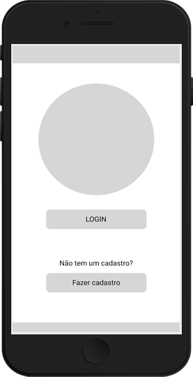

# Locker Face

## Índice
- [1. O Desafio](#1-o-projeto)
- [2. A aplicação](#2-a-aplicação)
- [3. Histórias de usuários](#3-histórias-de-usuários)
- [4. Planejamento](#4-planejamento)
  * [4.1 Organização](#41-organização)
  * [4.2 Protótipos](#42-protótipos)
- [5. Desenvolvimento](#5-desenvolvimento)
  * [5.2 Interface Final](#52-interface-final)
  * [5.3 Releases](#53-releases)
- [6. Tecnologias](#6-tecnologias)
- [7. Agradecimento](#7-agradecimento)
- [8. Desenvolvedoras](#8-desenvolvedoras)

***
## 1. O Desafio

Chegamos ao fim do Bootcamp, e como um último teste, recebemos da empresa Avanade um desafio.

Segurança é um problema cada vez maior hoje em dia e garanti-la em meios não digitais pode
ser ainda mais complexo. 

Hoje com o aumento da pandemia, quem quer ficar em filas enormes, passando por processos de autenticação demorados e manuais e que quase sempre são assistidos por dispositivos ou acessórios para garantir a identificação. Mas num mundo cada vez mais digital conseguimos garantir melhor experiência para as pessoas fazendo sua identificação sem usuários ou senhas e dispositivos utilizando o reconhecimento facial.

A expectativa com o desenvolvimento da aplicação é criar um site/app de identificação e cadastro utilizando a api de facial recognition da Microsoft.

<p align='right'><a href='#topo'>Voltar ao topo</a></p>

## 2. A aplicação

Com o desafio em mãos iniciamos o processo de identificar um problema, chegamos em uma questão que está muito ligado o momento que estamos vivendo hoje.

A pandemia aumentou muito a compra através da internet e com isso o volume de entregas. Muitas vezes não estamos presentes em nossas residências para recebe-las e não disponbilizamos de portaria 24 horas, com isso utilizamos o endereço comercial para receber nossas encomendas. O que também acaba não sendo uma experiência 100% agradável, uma vez que o entregador muitas vezes não pode esperar, a portaria do condomínio não tem autorização para receber, e você não sabendo o exato horário que será feita a entrega pode estar ocupado no momento.

Com isso idealizamos o **Locker Face**, um dispositivo para ser utilizado em lockers (para empresas em prédios coorporativos ou condomínios residenciais sem portaria 24 horas), onde o funcionário que possuir uma entrega no Locker poderá fazer a retirada do mesmo, destravando o armário através da identificação de sua face. Facilitando a logística do entregador que não mais precisará esperar o funcionário na portaria para fazer a entrega, e o recebedor que poderá fazer a retirada a qualquer hora, com total segurança.

<p align='right'><a href='#topo'>Voltar ao topo</a></p>

## 3. Histórias de usuários

A partir da idealização do projeto podemos criar as Histórias de Usuários:

* História de Usuário 1: <br> Eu como entregador ao chegar ao local querco cadastrar a encomenda no Locker Face e o mesmo liberar o armário de acordo com o tamanho da encomenda.

* História de Usuário 2: <br> Eu como destinatário  de uma encomenda quero cadastrar minha face para receber minhas encomendas.

* História de Usuário 3: <br> Eu como destinatário de uma encomenda quero liberar o armário que está minha encomenda pela reconhecimento de minha face.

* História de Usuário 4: <br> Eu como destinatário de uma encomenda quer liberar o armário que está minha encomenda pelo codigo de rastreio.

<p align='right'><a href='#topo'>Voltar ao topo</a></p>

##  4. Planejamento

#### 	4.1 Organização
Para conseguir entregar todas as funcionalidades do projeto, organizamos todo o fluxo de desenvolvimento do projeto pelo método [Kanban](https://pt.wikipedia.org/wiki/Kanban) no Trello. 

Dessa forma, definimos:

[MVP](https://pt.wikipedia.org/wiki/Produto_vi%C3%A1vel_m%C3%ADnimo)

Critérios mínimos de aceitação

Padronizações do código ([Code Style](https://en.wikipedia.org/wiki/Programming_style))

Divisão de tarefas

Para *merge* no repositório (*main*), somente após [*code review*](https://en.wikipedia.org/wiki/Code_review) para revisão em pares e aprovação da *reviewer*

[Daily Scrum](https://www.desenvolvimentoagil.com.br/scrum/daily_scrum)


#### 	4.2 Protótipos

Iniciamos o desenvolvimento da aplicação com um protótipo de baixa fidelidade para dar um direcionamento aos próximos.
[imagem do desenho ridiculo da Kauana]

A partir do desenho acima iniciamos o desenvolvimento do protótipo de média fidelidade através da ferramenta **Figma**.
<div align="center">
</img>
</div>
A prototipagem definitiva foi desenvolvida em conjunto com os mentores da Avanade para aprovação do tema e paleta de cores escolhidas.
[imagem do prototipo de alta fidelidade]

<p align='right'><a href='#topo'>Voltar ao topo</a></p>

## 5. Desenvolvimento

Com toda a identidade visual definida começamos a desenvolver a interface.
Os principais objetivos foram definidos logo de início:

A aplicação foi desenvolvida como SPA ([*single-page application*](https://en.wikipedia.org/wiki/Single-page_application)), para que o usuário tenha a experiência similar à de um aplicativo para *desktop*.

Utilizamos React JS para componentizar todo o site. Isso mantém a aplicação com alto desempenho e também permite que os componentes sejam reutilizados, gerando um código de fácil manutenção por qualquer desenvolvedor.

Instalamos o [ESLint](https://www.npmjs.com/package/eslint) na aplicação para manter o código padronizado e pronto para ser testado.

Fomos desafiadas a utilizar a **Azure**, API da Microsoft de facial recognition, para fazer o cadastramento e o validação  das faces.

Como forma de complemento da aplicação, foi necessário a utilização de uma segunda API. Inicialmente realizamos um mock para entregar a aplicação com todas as implementações. Esse mock pode ser alterado por uma API já existente do Locker.

### 5.2 Interface Final
Apresentamos a interface final da aplicação e todas as suas funcionalidades:
[Gif do site funcionando]

### 5.3 Releases

A aplicação está completa e funcional, mas sempre é possível melhorar.

Nossas próximas features são:

- [ ] Dupla validação caso a limear de confiança (confidenceThreshold) com a face detectada for entre 60% e 90%.
- [ ] Dupla validação para encomendas cadastradas com nomes incorretos ou imcompletos.
- [ ] Feedback de postagem no Locker para o Cliente.
- [ ] Feedback de retirada da postagem pelo Cliente para o Entregador.
- [ ] Melhoria na usabilidade do Locker pelo Entregador.
- [ ] Aplicar uma moldura facial para orientar o usuário na validação da face.
- [ ] Adição de mais uma layer de segurança para previnir desbloqueio por foto.
- [ ] Contactless Face Recognition: Reconhecimento automático da face mediante aproximação do dispositivo.

Essa lista pode aumentar de acordo com a necessidade do cliente.

<p align='right'><a href='#topo'>Voltar ao topo</a></p>


## 6. Tecnologias

Hamburgueria Ipê utiliza as seguintes ferramentas:

**Code:**

[](https://pt-br.reactjs.org/) [](https://html5.org/) [](https://www.w3.org/Style/CSS/Overview.en.html) [](https://developer.mozilla.org/pt-BR/docs/Web/JavaScript) [](https://vercel.com/)

**Planejamento:**

[](https://trello.com/) [](https://www.figma.com/)

Fique à vontade para rodar o projeto localmente. É bem simples!

**1 -** Clone o repositório para seu local

**2 -** Abra o terminal e instale o [NPM](https://www.npmjs.com/get-npm)

```js ('*.js')  
npm install
```

**3 -** Entre na pasta raiz do projeto e digite:

```
npm start
```

Enjoy 👊

<p align='right'><a href='#topo'>Voltar ao topo</a></p>

## 7. Agradecimento

Inicialmente gostaríamos de agradecer a **Avanade**, pela confiança e pelo apoio dado durante todo o tempo de hackaton.
Nossa equipe ficou extasiada com o desafio proposto por vocês.

Gostaríamos de agradecer também a Laboratória por estar nos apoiando nessa nova jornada.

Não menos importante gostaríamos de agradecer a todas as colegas de código, em especial a [Akemi Mitsueda](https://github.com/akemimeka), [Caroline Costa](https://github.com/CarolineSCosta) e [Gabriela Silva](https://github.com/gabrielasilva1991).


<p align='right'><a href='#topo'>Voltar ao topo</a></p>

## 8. Desenvolvedoras

- [Ana Clara Farah](https://github.com/anaclara-gf)
- [Camila Oliveira](https://github.com/cbalieiro)
- [Cristina Mantovani](https://github.com/crismantovani)
- [Dunia Ghazzaoui](https://github.com/dunia07)
- [Kauana Agostini](https://github.com/kauanaagostini)
- [Lucila Xavier](https://github.com/Lucilaxavier)

<p align='right'><a href='#topo'>Voltar ao topo</a></p>