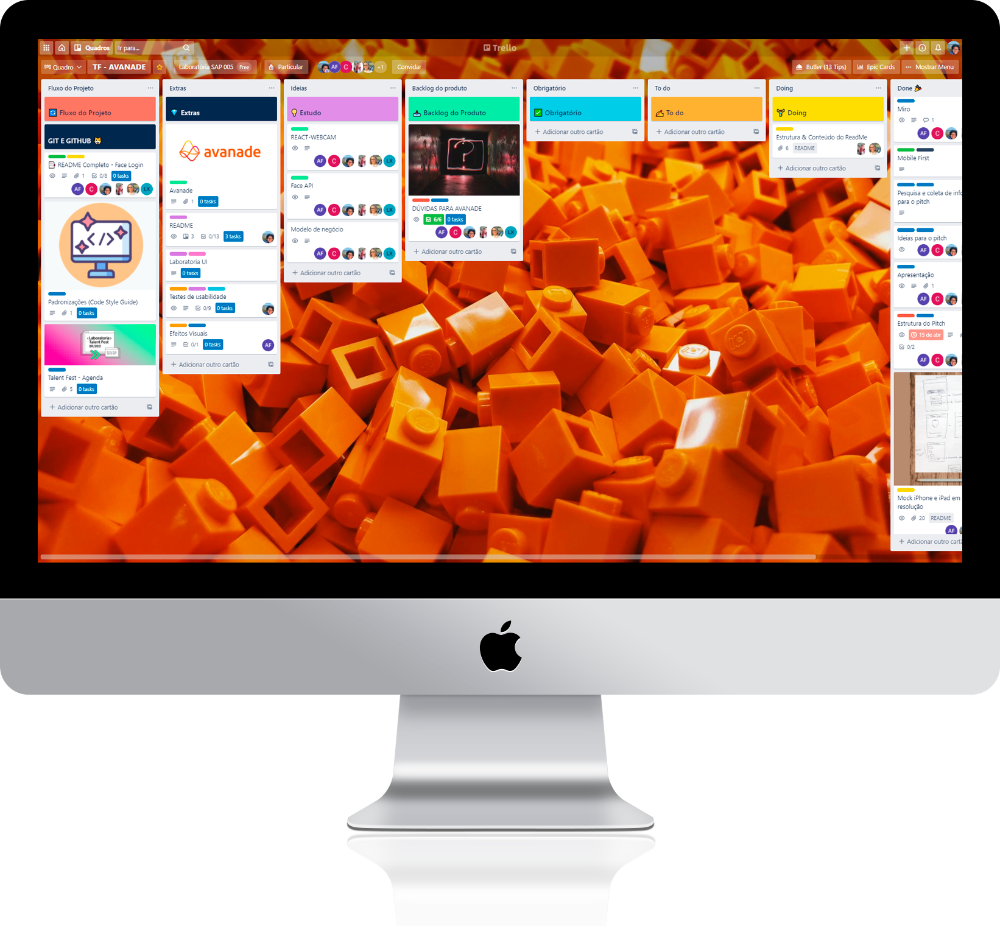
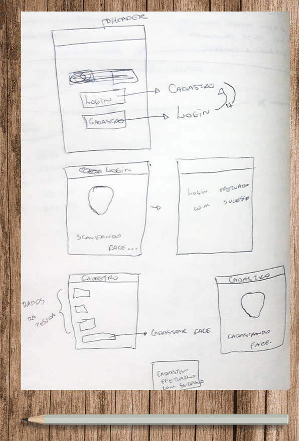
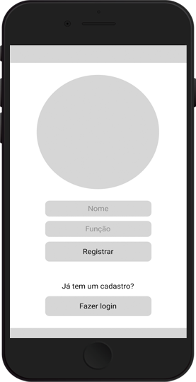
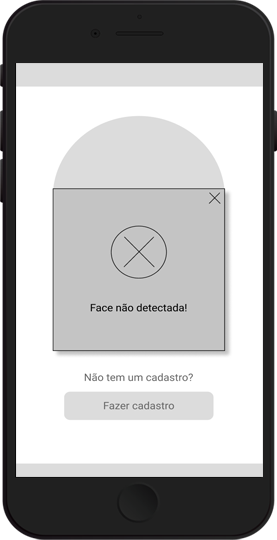
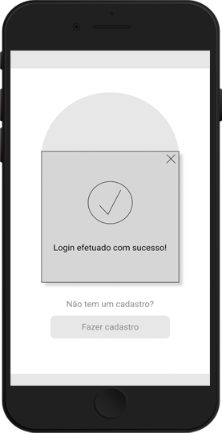
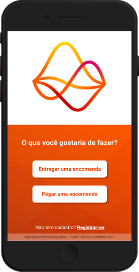
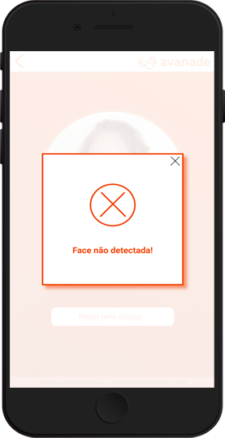
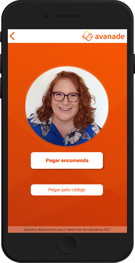
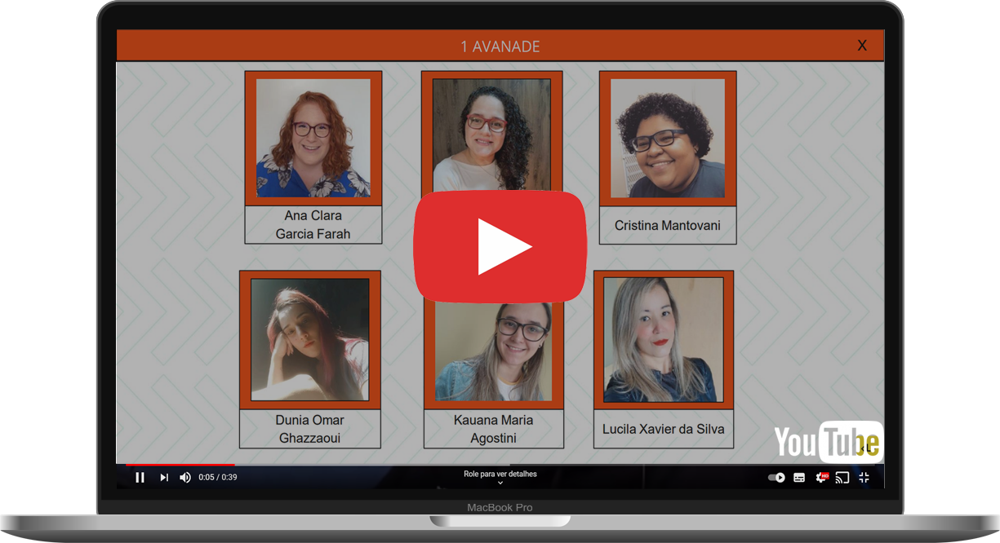

<div align="center" id='locker-face'>
  <h1>Locker Face</h1>
⚛️ 🤳 🗄️ 🔐 🚀
</div>

## 📑 Índice
- [1. Desafio](#1-desafio)
- [2. A aplicação](#2-a-aplicação)
- [3. Histórias de usuários](#3-histórias-de-usuários)
- [4.Planejamento](#4-planejamento)
  - [4.2 Protótipos](#42-protótipos)
- [5. Desenvolvimento](#5-desenvolvimento)
- [6. Interface Final](#6-interface-final)
- [7. Releases](#7-releases)
- [8. Tecnologias](#️8-tecnologias)
- [9. Agradecimentos](#9-agradecimentos)
- [10. Desenvolvedoras](#10-desenvolvedoras)

***
## 1. Desafio 🎯

Chegamos ao fim do *bootcamp* da [Laboratória](https://www.laboratoria.la/br), e, como um último teste, recebemos da empresa [**Avanade**](https://www.avanade.com/pt-br) um desafio.

Segurança é um problema cada vez maior hoje em dia e garanti-la em meios não digitais pode
ser ainda mais complexo. 

Hoje com o aumento da pandemia, quem quer ficar em filas enormes, passando por demorados processos de autenticação manuais, que quase sempre são assistidos por dispositivos ou acessórios para garantir a identificação?

Em um mundo cada vez mais digital, conseguimos aumentar experiência dos usuários fazendo sua identificação apenas por **Reconhecimento facial**.

Para isso, devemos criar uma aplicação web para cadastro e identificação dos usuários, utilizando a [Microsoft Azure Face API](https://azure.microsoft.com/pt-br/services/cognitive-services/face/).

<p align='right'><a href='#locker-face'>Voltar ao topo</a></p>

## 2. A aplicação 💡

Com o desafio em mãos iniciamos o processo de identificar um problema, chegamos em uma questão que está muito ligado o momento que estamos vivendo hoje.

A pandemia aumentou muito a compra através da internet e com isso o volume de entregas. Muitas vezes não estamos presentes em nossas residências para recebe-las e não disponibilizamos de portaria 24 horas, com isso utilizamos o endereço comercial para receber nossas encomendas. O que também acaba não sendo uma experiência 100% agradável, uma vez que o entregador muitas vezes não pode esperar, a portaria do condomínio não tem autorização para receber, e você não sabendo o exato horário que será feita a entrega pode estar ocupado no momento.

Com isso idealizamos o **Locker Face**, um dispositivo para ser utilizado em lockers (para empresas em prédios corporativos ou condomínios residenciais sem portaria 24 horas), onde o funcionário que possuir uma entrega no Locker poderá fazer a retirada do mesmo, destravando o armário através da identificação de sua face. Facilitando a logística do entregador que não mais precisará esperar o funcionário na portaria para fazer a entrega, e o recebedor que poderá fazer a retirada a qualquer hora, com total segurança.

<p align='right'><a href='#locker-face'>Voltar ao topo</a></p>

## 3. Histórias de usuários 🗣️

A partir da idealização do projeto podemos criar as Histórias de Usuários:

✍️ **História de usuário 1:** Eu, como entregador, ao chegar ao local quero poder cadastrar a encomenda no **Locker Face** e o mesmo liberar o armário de acordo com o tamanho da encomenda.

✍️ **História de usuário 2:** Eu, como destinatário de uma encomenda, quero poder cadastrar minha face para receber minhas encomendas.

✍️ **História de usuário 3:** Eu, como destinatário de uma encomenda, quero poder liberar o armário que está minha encomenda pela reconhecimento de minha face.

✍️ **História de usuário 4:** Eu, como destinatário de uma encomenda, quero poder liberar o armário que está minha encomenda pelo código de rastreio.

<p align='right'><a href='#locker-face'>Voltar ao topo</a></p>

## 4. Planejamento 📆

  <div align='center'></img>
  </div>

 Para conseguir entregar todas as funcionalidades do projeto, organizamos todo o fluxo de desenvolvimento do projeto pelo método [Kanban](https://pt.wikipedia.org/wiki/Kanban) no Trello. 

Dessa forma, definimos:

:seedling: [MVP](https://pt.wikipedia.org/wiki/Produto_vi%C3%A1vel_m%C3%ADnimo)

:call_me_hand: Critérios mínimos de aceitação

:label: Padronizações do código ([Code Style](https://en.wikipedia.org/wiki/Programming_style))

:hammer_and_pick:  Divisão de tarefas

🔐 Para *merge* no repositório (*main*), somente após [*code review*](https://en.wikipedia.org/wiki/Code_review) para revisão em pares e aprovação da *reviewer*

🤝 [Daily Scrum](https://www.desenvolvimentoagil.com.br/scrum/daily_scrum)

<br>

  <div align='center'>
    
    </img>
    
 Você pode acessar [**nosso quadro aqui**](https://trello.com/b/qFhaTDXI/tf-avanade) ou clicar na imagem para ampliar
  </div>

#### 4.2 Protótipos ✍

Iniciamos o desenvolvimento da aplicação com um protótipo de baixa fidelidade e ter um norte para os próximos:
<div align="center">
</img>

🔎 *Clique na imagem para ampliar*

</div>

A partir do desenho acima iniciamos o desenvolvimento do protótipo de média fidelidade através da ferramenta 

#### Figma

<div align="center">
 &nbsp; </img> </img>
<br>
 &nbsp; </img> </img>

🔎 *Clique nas imagens para ampliar*

</div>

A prototipagem definitiva foi desenvolvida em conjunto com os mentores da Avanade para aprovação do tema e paleta de cores escolhidas.

Você pode acessar nosso protótipo no [Figma clicando aqui](https://www.figma.com/file/02kXYCFJPXfP43LpWLQSrX/Talent-fest-2021?node-id=0%3A1).

<div align="center">
</img> &nbsp; </img>
<br>
</img> &nbsp; </img>

🔎 *Clique nas imagens para ampliar*
</div>

<p align='right'><a href='#locker-face'>Voltar ao topo</a></p>

## 5. Desenvolvimento 💻

🛠️ Com a identidade visual definida, começamos a desenvolver a interface.
Os principais objetivos foram definidos logo de início:

🧾 A aplicação foi desenvolvida como SPA ([*single-page application*](https://en.wikipedia.org/wiki/Single-page_application)), para que o usuário tenha a experiência similar à de um aplicativo para *desktop*.

🧩 Utilizamos React JS para componentizar todo o site. Isso mantém a aplicação com alto desempenho e também permite que os componentes sejam reutilizados, gerando um código de fácil manutenção por qualquer desenvolvedor.

✨ Instalamos o [ESLint](https://www.npmjs.com/package/eslint) na aplicação para manter o código padronizado e pronto para ser testado.

⚙️ [Microsoft Azure Face API](https://azure.microsoft.com/pt-br/services/cognitive-services/face/) para fazer o cadastro e a validação dos rostos.

🛡️ Como forma de complemento da aplicação, foi necessário a utilização de uma segunda API. Inicialmente realizamos um mock para entregar a aplicação com todas as implementações. Esse mock pode ser alterado por uma API já existente do Locker.

### 6. Interface Final 🎨
Apresentamos a interface final da aplicação e todas as suas funcionalidades:
<div align="center">
</img>

🔎 *Clique na imagem para ampliar*

</div>

### 7. Releases 💫

A aplicação está completa e funcional, mas sempre é possível melhorar.

Nossas próximas features são:

- [ ] Dupla validação caso a limiar de confiança (confidenceThreshold) com a face detectada for entre 60% e 90%.
- [ ] Dupla validação para encomendas cadastradas com nomes incorretos ou incompletos.
- [ ] Feedback de postagem no Locker para o cliente.
- [ ] Feedback de retirada da postagem pelo cliente para o entregador.
- [ ] Melhoria na usabilidade do Locker pelo entregador.
- [ ] Aplicar uma moldura facial para orientar o usuário na validação da face.
- [ ] Adição de mais uma layer de segurança para prevenir desbloqueio por foto.
- [ ]  Face Recognition: Reconhecimento automático da face mediante aproximação do dispositivo.

*Essa lista pode aumentar de acordo com a necessidade do cliente.*

<p align='right'><a href='#locker-face'>Voltar ao topo</a></p>


## 8. Tecnologias ⚙️

Utilizamos as seguintes ferramentas:

**Code:**

[](https://pt-br.reactjs.org/) [](https://html5.org/) [](https://www.w3.org/Style/CSS/Overview.en.html) [](https://developer.mozilla.org/pt-BR/docs/Web/JavaScript) [](https://vercel.com/)

**Planejamento:**

[](https://trello.com/) [](https://www.figma.com/)

Fique à vontade para rodar o projeto localmente. É bem simples!

**1 -** Clone o repositório para seu local

**2 -** Abra o terminal e instale o [NPM](https://www.npmjs.com/get-npm)

```js ('*.js')  
npm install
```

**3 -** Entre na pasta raiz do projeto e digite:

```
npm start
```

Enjoy 👊

<p align='right'><a href='#locker-face'>Voltar ao topo</a></p>

## 9. Agradecimentos 🙌

Inicialmente gostaríamos de agradecer a **Avanade**, pela confiança e pelo apoio dado durante todo o tempo de hackaton.
Nossa equipe ficou extasiada com o desafio proposto por vocês.

Gostaríamos de agradecer também a Laboratória por estar nos apoiando nessa nova jornada.

Não menos importante gostaríamos de agradecer a todas as colegas de código, em especial a [Akemi Mitsueda](https://github.com/akemimeka), [Caroline Costa](https://github.com/CarolineSCosta) e [Gabriela Silva](https://github.com/gabrielasilva1991).


<p align='right'><a href='#locker-face'>Voltar ao topo</a></p>

## 10. Desenvolvedoras 👩‍💻
  <div align="center">
    
    </img>
  </div>

<br>

🏆 **Face Locker** foi orgulhosamente desenvolvido em 3 dias por 6 mulheres que formaram a squad da Avanade, que conquistou o 1º lugar do Talent Fest 2021 do *bootcamp* da [Laboratória](https://github.com/Laboratoria).

Veja nossa apresentação e de todas as nossas colegas no vídeo abaixo:
<br>
 <div align='center'><a href='https://youtu.be/I4quRx-Nrs4?t=849'>
 </a>

 ▶️ *Clique para dar reproduzir o vídeo*

  </div>
<br>
Se você ficou com alguma dúvida, tem sugestões ou quer apenas nos conhecer melhor, por favor, entre em contato :)

 <div align='center'>
 
| </img> | </img> | </img> | </img>| </img> | </img>   	|
|:-----------------:	|:-----------------:	|:------------------:	|:-----------------:	|:-----------------:	|:-----------------:	|
|<a href='https://github.com/anaclara-gf'></img></a> <a href='https://www.linkedin.com/in/anaclaragf/'></img></a> | <a href='https://github.com/cbalieiro'></img></a> <a href='https://www.linkedin.com/in/camilabalieiro/'></img></a>	| <a href='https://github.com/crismantovani'></img></a> <a href='https://www.linkedin.com/in/crissmantovani/'></img></a> | <a href='https://github.com/dunia07'></img></a> <a href='https://www.linkedin.com/in/dunia-ghazzaoui/'></img></a>| <a href='https://github.com/kauanaagostini'></img></a> <a href='https://www.linkedin.com/in/kauanaagostini/'></img></a> | <a href='https://github.com/Lucilaxavier'></img></a> <a href='https://www.linkedin.com/in/lucila-xavier-da-silva/'></img></a>	|

</div>

<p align='right'><a href='#locker-face'>Voltar ao topo</a></p>
